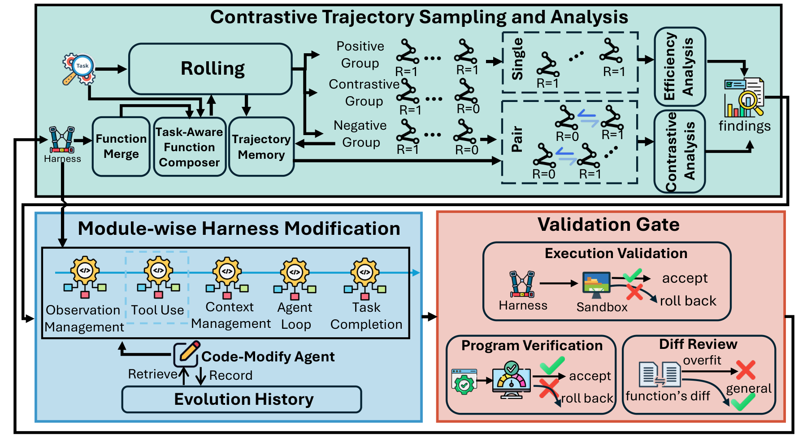

# ModularRSI

<p align="center"><strong><em>⭐ Star us if you find this useful!</em></strong></p>

<p align="center">
  <a href="https://arxiv.org/pdf/2609.14857"></a>
  <a href="https://huggingface.co/papers/2609.14857"></a>
  <a href="https://github.com/IQuestLab/ModularRSI"></a>
  <a href="https://huggingface.co/datasets/IQuestLab/ModularRSI_2000_Instances"></a>
</p>

<p align="center">
  Siwei Wu · Jincheng Ren · Yizhi Li · Haau-Sing Li · Chengran Yang<br>
  Yuxuan Zhang · Weicheng Gu · Jian Yang · Riza Batista-Navarro · Chuanyi Zhang<br>
  Xianglong Liu · Ming Zhou · Bryan Dai · Chenghua Lin
</p>

<p align="center">
  <strong><a href="https://github.com/IQuestLab">IQuest Research</a></strong>
</p>

<p align="center">
  
</p>

**ModularRSI studies generalizable Harness RSI: can an agent improve its
harness from independent execution experience and transfer the improvement to
unseen tasks, domains, and foundation models?**

Modern agent capability depends not only on the foundation model, but also on
the harness that controls interaction, observations, context, tools, and task
completion. ModularRSI decomposes this harness into five evolvable modules:

```text
agent_loop · observation · tools · context_mgmt · Task Completion Detection
```

It learns from a benchmark-independent evolution pool, contrasts successful and
failed trajectories, applies scoped module changes, and integrates only
candidates that pass validation gates. The study improves Terminal-Bench 2.0
accuracy from **47.57% to 52.43%** with DeepSeek-V4-Flash-Preview and evaluates
transfer across unseen tasks, domains, and models.

## How it works

[](assets/figures/modularrsi-overview.pdf)

*Figure 1 from the [paper](https://arxiv.org/pdf/2609.14857v1#page=4). Click the figure for the original PDF.*

ModularRSI analyzes successful and failed trajectories, aggregates findings across
tasks, and evolves each of the five modules independently. Program checks, diff
review, and execution validation filter proposed changes. Cross-module integration
then resolves interactions among the evolved modules, and the resulting function
library is frozen for downstream evaluation.

## Results

Accuracy (%) reported in [Table 2](https://arxiv.org/pdf/2609.14857v1#page=9),
using DeepSeek-V4-Flash-Preview. Each evolved harness is frozen before evaluation
on both held-out benchmarks.

| Evolution set | Terminal-Bench 2.0 | SWE-Bench Verified |
| --- | ---: | ---: |
| No evolution | 47.57 | 73.40 |
| TB-related | **52.43** | 75.80 |
| SWE-related | 49.40 | **76.45** |

TB-related evolution transfers to SWE-Bench Verified, and SWE-related evolution
transfers to Terminal-Bench 2.0. The paper also reports cross-model transfer on
Terminal-Bench 2.0: GLM-5.2 improves from 59.55% to 61.80%, and MiniMax-2.5 from
41.57% to 44.94% ([Table 3](https://arxiv.org/pdf/2609.14857v1#page=9)).

## Evolution dataset

The evolution dataset is available on Hugging Face as
[`IQuestLab/ModularRSI_2000_Instances`](https://huggingface.co/datasets/IQuestLab/ModularRSI_2000_Instances).
It contains 1,000 terminal tasks and 1,000 software-engineering tasks across nine
categories. The paper's main evolution experiments use 120 tasks from each domain;
these training tasks are marked in the domain manifests.

## Run

```bash
python3 -m venv .venv
. .venv/bin/activate
python -m pip install -e .
cp .env.example .env
# Put your API key and endpoint in .env.
```

Edit the parameter block at the top of the launcher you want to run.

```bash
# Evolve
bash scripts/evolve.sh

# Evaluate
bash scripts/evaluate.sh
```

The included module library is under
[`generations/merged_active`](generations/merged_active/README.md). Evolution
runs are stored under `self_evo_runs/runs/<run-id>/`.

## License

Original ModularRSI research contributions are available under
[CC BY-NC 4.0](https://creativecommons.org/licenses/by-nc/4.0/deed.en) for
non-commercial use only. See
[LICENSE-MODULARRSI.md](LICENSE-MODULARRSI.md).

Harbor-derived code remains under the Apache License 2.0 in [LICENSE](LICENSE).
Third-party components and datasets retain their respective licenses.

## Citation

```bibtex
@article{wu2026modularrsi,
  title={ModularRSI: Modular and Generalizable Recursive Harness Self-Improvement},
  author={Wu, Siwei and Ren, Jincheng and Li, Yizhi and Li, Haau-Sing and Yang, Chengran and Zhang, Yuxuan and Gu, Weicheng and Yang, Jian and Batista-Navarro, Riza and Zhang, Chuanyi and others},
  journal={arXiv preprint arXiv:2609.14857},
  year={2026}
}
```
